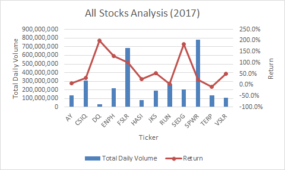
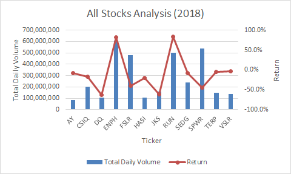
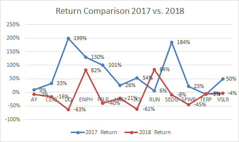
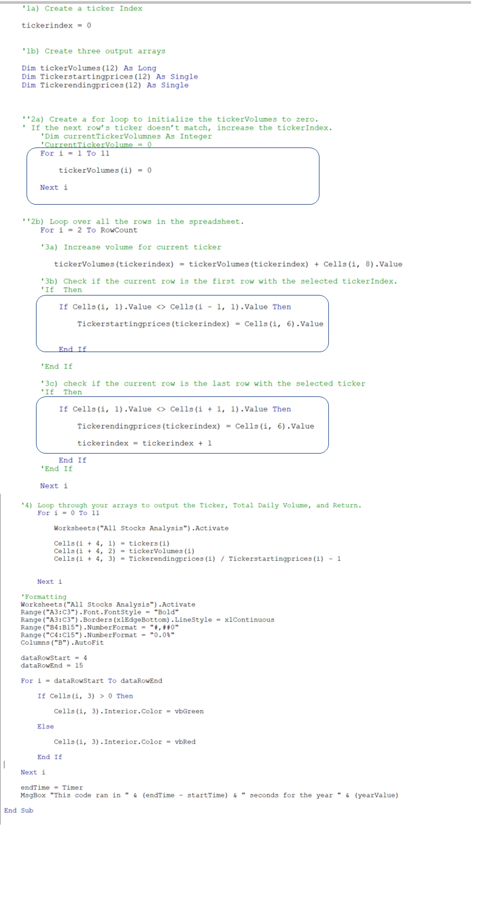

# stock-analysis
Module 2_stock-analysis

## Overview of Project
After analysing the DQ fund, Steve is trying to form a better porfolio for his parents so they could make better investment. To understand each stock's performance, Steve created a excel and VBA script to make show the daily column and return. 
### Purpose
In order to make the script be able to analyze thousands of the stocks, we need to refactor his code to make VBA run faster. There is no addtional functions added, just few codes to make it more efficient. 
## Results
### Stock Analysis
2017 and 2018 results were shown in detailed in below charts. 

Compare the return year by year, majority of the stocks excpet RUN and TERP had negative decrease in return IN 2018, which indicate that 2018 is a bad year in general in this market. 

    
### Detailed codes
As shown below, the code I used helped to create loop to run the code for different index. The basic idea is when the row number hits the next row and excel will know it is a different ticker, then the volumn will increment accordingly as well.

Detail Refactoring Codes:

   

## Summary 

- What are the advantages or disadvantages of refactoring code?
    - Advantages include use less space in the memeory, able to run larger data set, able to run faster
    - Disadvantages include when the original codes are not tested, then the re-factoring code might not be working, either. 
- How do these pros and cons apply to refactoring the original VBA script?
    - I personally get to practice what I learnt in class.Other than that, the For loop really helps to run the data more effeciently.
    

